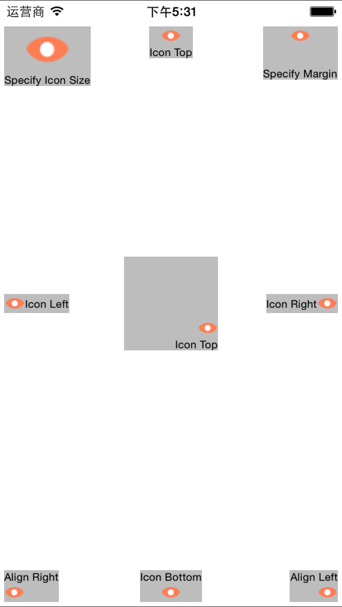
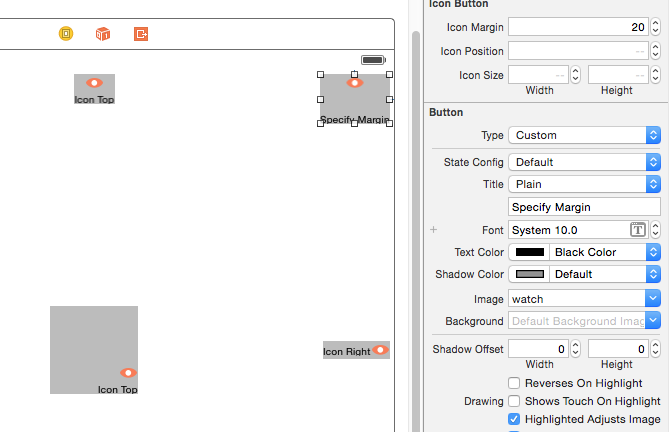
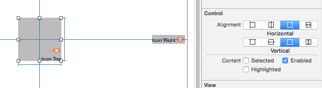

# RTIconButton

[](https://travis-ci.org/rickytan/RTIconButton)
[](http://cocoapods.org/pods/RTIconButton)
[](http://cocoapods.org/pods/RTIconButton)
[](http://cocoapods.org/pods/RTIconButton)

This is a drop-in replacement for `UIButton`, which support convenient configuration for image icon's position and icon title margin.

It also support control centent aligns.

**NOTE:** To support IB, you must set use_frameworks! in your Podfile.



## Usage

1. Drag and drop a `UIButton` to your controller
2. set the **Class** to `RTIconButton`
3. set the icon position, icon margin and icon size. If size is not specified, it will displayed in the image natural size.





To run the example project, clone the repo, and run `pod install` from the Example directory first.

## Requirements

- **UIKit**
- **Xcode 6**

## Installation

RTIconButton is available through [CocoaPods](http://cocoapods.org). To install
it, simply add the following line to your Podfile:

```ruby
pod "RTIconButton"
```

## License

RTIconButton is available under the MIT license. See the LICENSE file for more info.
